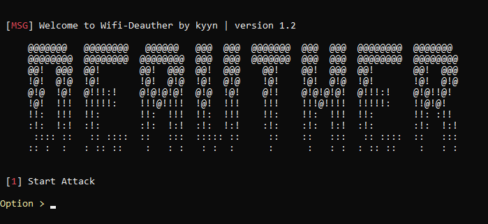

 
Deauther is a simple bash script that makes it easy to use aireplay-ng deauth, putting together all the necessary commands in one script.

## 💭 Installing
1. First clone my repository ``git clone https://github.com/mavinsi/wifi-deauther ``
2. Give execution permission to the script ``sudo chmod +x install.sh``
3. now run the install script ``sudo ./install.sh``
## 🏃 Execute & Using
To run is simple just type ``./deauth.sh``, the program has a GUI to make it easier to use so you don't need any more commands besides following the steps below
<ol>
<li> After run the script you need choose a option for start the deauther, to do this use the option 1 </li>
<li> Now choose a interface to use (ex: wlan1, wlan0 and etc)</li>
<li> Copy the BSSID of the network that will be the target and record your channel too</li>
<li> Now you will enter airodump-ng, after you are ready just use CTRL+C to start the attack!</li>
<ol>
